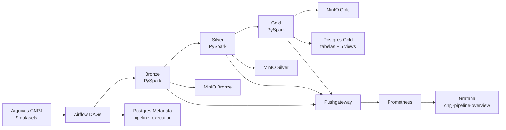

# CNPJ Data Lake

## Arquitetura Moderna de Data Lake com PostgreSQL e MinIO

### 📋 Visão Geral

Projeto de Data Lake profissional para ingestão, processamento e análise de dados CNPJ (Cadastro Nacional de Pessoa Jurídica) do Brasil, utilizando as melhores práticas de engenharia de dados.

**Tecnologias:**

- **PostgreSQL 15**: Banco de dados relacional para metadados
- **MinIO**: Object Storage compatível com S3
- **Python 3.10+**: Processamento de dados
- **Docker Compose**: Orquestração de containers

---

## 🏗️ Arquitetura de Camadas

```
┌─────────────────────────────────────────────────────────┐
│                      FONTES DE DADOS                    │
│  (Arquivos CNPJ: Empresas, Estabelecimentos, Sócios)   │
└────────────────────┬────────────────────────────────────┘
                     │
        ┌────────────▼────────────┐
        │   CAMADA BRONZE         │
        │  (Dados Brutos)         │
        │ MinIO Bucket            │
        │ Sem Transformação       │
        └────────────┬────────────┘
                     │
        ┌────────────▼────────────┐
        │   CAMADA SILVER         │
        │ (Dados Limpos)          │
        │ Validações Aplicadas    │
        │ Normalizações           │
        └────────────┬────────────┘
                     │
        ┌────────────▼────────────┐
        │   CAMADA GOLD           │
        │ (Dados Finais)          │
        │ Dados limpos detalhados │
        │ Pronto para consumo     │
        └────────────┬────────────┘
                     │
        ┌────────────▼────────────┐
        │  POSTGRESQL METADATA    │
        │ Rastreamento de Logs    │
        │ Alertas de Qualidade    │
        └────────────────────────┘
```

### Desenho de arquitetura atualizado



Observabilidade baseline do projeto:
- dashboard provisionado `cnpj-pipeline-overview` com paineis de stage + fallback de encoding;
- metricas estaveis de execucao, duracao, registros e fallback de encoding;
- sem paineis/metricas experimentais de comportamento de IA no baseline.

---

## 🤖 Contexto do Projeto do Agente

Este DataLake e o backend de dados do projeto `agente-contabilizei-tcc` (Streamlit + LLM).

### Como o agente consome os dados

- Fonte principal: PostgreSQL (`cnpj_gold.*`)
- Fallback: DuckDB lendo Parquet no MinIO
- Escopo de consulta: somente camada Gold

### Comportamento atual importante

- O agente agora prioriza tabelas Gold que **existem e possuem linhas** no Postgres.
- Se uma tabela existe mas estiver vazia (ex.: `cnpj_gold.cnaes` com `0` linhas), ela nao e priorizada na descoberta automatica.
- A descoberta de meses (`dataset_month`) considera uniao de todas as tabelas Gold com dados, nao apenas uma tabela especifica.

### O que isso resolve

- Evita que o LLM gere SQL em tabelas vazias quando existem tabelas com dados.
- Melhora perguntas de negocio como "quantos CNPJs no mes X" usando as tabelas Gold detalhadas preenchidas.

### Dependencia operacional

Se todas as tabelas Gold estiverem vazias no Postgres, o agente respondera sem resultado.
Nessa situacao, execute novamente as DAGs no Airflow para repovoar a Gold antes de testar perguntas.

---

## 🚀 Quick Start

### 1. Pré-requisitos

```bash
# Windows/WSL2
- Docker Desktop (com WSL2 ou Hyper-V)
- Python 3.10+
- Git

# Clonar repositório
git clone <repo-url>
cd CNPJ-DataLake
```

### 2. Iniciar Serviços

```bash
# Criar arquivo .env (obrigatorio — copie o exemplo e ajuste as senhas)
cp .env.example .env

# Iniciar containers
docker compose -f infra/docker-compose.yml up -d --build

# Aguarde ~30s para que os servicos estejam prontos
docker compose -f infra/docker-compose.yml ps
```

### 2.1 Orquestração com Airflow

O projeto agora inclui Airflow para orquestrar Bronze -> Silver -> Gold.

```bash
# 1) Copiar e ajustar segredos
cp .env.example .env

# 2) Subir infraestrutura + Airflow
docker compose -f infra/docker-compose.yml up -d --build postgres minio minio-init airflow-init airflow-webserver airflow-scheduler

# 3) Acessar UI
# http://localhost:8080
# usuário padrão: admin
# senha padrão: admin (ou o valor de AIRFLOW_ADMIN_PASSWORD no .env)
```

Variaveis importantes no `.env` para as DAGs:

- `AIRFLOW_PIPELINE_SCHEDULE`: agendamento da DAG. Em modo manual use `manual`.
- `INGESTION_DATA_MONTH`: mes padrao do dataset a ser ingerido (defina antes de rodar).
- `AIRFLOW_DATA_VERSION_OVERRIDE`: compatibilidade legada; prefira `INGESTION_DATA_MONTH`.

A definicao das DAGs esta em `services/airflow/dags/cnpj_dataset_dags.py`.

Tambem foram adicionadas DAGs compartimentalizadas:

- `cnpj_empresas_pipeline`
- `cnpj_estabelecimentos_pipeline`
- `cnpj_socios_pipeline`
- `cnpj_cnaes_pipeline`
- `cnpj_motivos_pipeline`
- `cnpj_municipios_pipeline`
- `cnpj_naturezas_pipeline`
- `cnpj_paises_pipeline`
- `cnpj_qualificacoes_pipeline`

Cada uma usa seu proprio arquivo de entrada configurado no `.env`, apontando para subpastas em `data/input/` no host e `/opt/airflow/data/input/` no container. Tambem e possivel usar nome cru extraido do zip por meio de padroes alternativos separados por `|`.

- `AIRFLOW_SOURCE_FILE_EMPRESAS`
- `AIRFLOW_SOURCE_FILE_ESTABELECIMENTOS`
- `AIRFLOW_SOURCE_FILE_SOCIOS`
- `AIRFLOW_SOURCE_FILE_CNAES`
- `AIRFLOW_SOURCE_FILE_MOTIVOS`
- `AIRFLOW_SOURCE_FILE_MUNICIPIOS`
- `AIRFLOW_SOURCE_FILE_NATUREZAS`
- `AIRFLOW_SOURCE_FILE_PAISES`
- `AIRFLOW_SOURCE_FILE_QUALIFICACOES`

### 2.2 Definir data_version no Trigger DAG

Para execucao pontual, use o campo **Run Configuration / Conf** no botao **Trigger DAG** da UI do Airflow.

Exemplo de payload:

```json
{"dataset_month":"2026-03"}
```

Se sua UI nao mostrar esse campo, defina antes de ingerir no `.env`:

```env
INGESTION_DATA_MONTH=2026-03
```

Depois recarregue os servicos do Airflow:

```bash
docker compose -f infra/docker-compose.yml up -d airflow-webserver airflow-scheduler
```

Prioridade usada pelas DAGs para resolver `data_version`:

1. `dag_run.conf.dataset_month` ou `dag_run.conf.data_version` (payload do Trigger DAG)
2. `INGESTION_DATA_MONTH` (se definido)
3. `AIRFLOW_DATA_VERSION_OVERRIDE` (se definido)
4. `DATA_VERSION` (fallback de ambiente)
5. `logical_date` do Airflow (fallback final)

Isso permite processar arquivos de marco mesmo quando o trigger acontece em outro mes.
O mes utilizado tambem fica registrado em `cnpj_metadata.pipeline_execution.dataset_month` e `cnpj_metadata.pipeline_execution.data_version`.

### 2.3 Consultar historico anual

Para historico anual, nao fixe um unico mes. Filtre por ano usando `data_version` (formato `YYYY-MM`).

Exemplo (Postgres):

```sql
SELECT
    LEFT(data_version, 4) AS ano,
    data_version,
    COUNT(DISTINCT cnpj_basico) AS total_cnpjs
FROM cnpj_gold.estabelecimentos
WHERE LEFT(data_version, 4) = '2026'
GROUP BY LEFT(data_version, 4), data_version
ORDER BY data_version;
```

Exemplo de consolidado anual:

```sql
SELECT
    LEFT(data_version, 4) AS ano,
    COUNT(DISTINCT cnpj_basico) AS total_empresas_ano
FROM cnpj_gold.empresas
WHERE LEFT(data_version, 4) = '2026'
GROUP BY LEFT(data_version, 4);
```

### 2.4 Reset total de dados

Para recomecar do zero em Postgres e MinIO, use:

```bash
python src/scripts/reset_datastores.py
```

O script remove todos os objetos dos buckets Bronze/Silver/Gold e recria os schemas do Postgres a partir de `services/postgres/schemas.sql`.

### 3. Acessar Serviços

| Serviço | URL | Credenciais |
|---------|-----|-------------|
| **PostgreSQL** | `localhost:5432` | user: `datalake_app` / pwd: ver `.env` |
| **MinIO API** | `http://localhost:9000` | user: `minio_root` / pwd: ver `.env` |
| **MinIO Console** | `http://localhost:9001` | user: `minio_root` / pwd: ver `.env` |
| **Airflow** | `http://localhost:8080` | user: `admin` / pwd: ver `.env` |
| **pgAdmin** | `http://localhost:5050` | ver `.env` |
| **Jupyter Lab** | `http://localhost:8888` | token: ver `.env` |

### 4. Instalar Dependências Python

```bash
# Criar ambiente virtual
python -m venv venv
source venv/bin/activate  # No Windows: venv\Scripts\activate

# Instalar dependências
pip install -r requirements.txt

# (Opcional) Ferramentas de desenvolvimento
pip install -e .[dev]

# (Opcional) Ambiente de notebooks
pip install -e .[notebook]
```

Obs.: `requirements.txt` agora contem apenas dependencias de runtime do pipeline.

---

## 📂 Estrutura do Projeto

```
CNPJ-DataLake/
├── services/
│   ├── airflow/
│   │   ├── dags/cnpj_dataset_dags.py
│   │   ├── Dockerfile
│   │   └── requirements.txt
│   ├── pyspark/cli/run_pipeline.py
│   ├── minio/init-minio.sh
│   └── postgres/
│       ├── init-db.sh
│       └── schemas.sql
├── data/
│   ├── input/
│   │   ├── empresas/
│   │   ├── estabelecimentos/
│   │   ├── socios/
│   │   ├── cnaes/
│   │   ├── motivos/
│   │   ├── municipios/
│   │   ├── naturezas/
│   │   ├── paises/
│   │   └── qualificacoes/
│   └── consumed/                  # arquivos movidos apos ingestao
├── docs/                          # runbook, arquitetura, contexto
├── infra/
│   └── docker-compose.yml         # stack completa
├── src/
│   └── cnpj_datalake/             # pacote Python principal
├── tests/
├── .env.example
├── pyproject.toml
└── requirements.txt
```

---

## 🔧 Configuração

### Arquivo `.env`

```env
# PostgreSQL
PG_HOST=localhost
PG_PORT=5432
PG_USER=datalake_app
PG_PASSWORD=datalake_app_change_me
PG_DATABASE=cnpj_datalake

# MinIO
MINIO_ENDPOINT=localhost:9000
MINIO_ACCESS_KEY=cnpj_app_user
MINIO_SECRET_KEY=cnpj_app_change_me

# Processamento
BATCH_SIZE=100000
QUALITY_THRESHOLD=90.0
DATA_VERSION=2026-06         # fallback para CLI local

# Airflow — paths dos arquivos no container
AIRFLOW_PIPELINE_SCHEDULE=manual
INGESTION_DATA_MONTH=
AIRFLOW_DATA_VERSION_OVERRIDE=
AIRFLOW_SOURCE_FILE_EMPRESAS=/opt/airflow/data/input/empresas/Empresas*.txt|/opt/airflow/data/input/empresas/[!.]*
AIRFLOW_SOURCE_FILE_ESTABELECIMENTOS=/opt/airflow/data/input/estabelecimentos/Estabelecimentos*.txt|/opt/airflow/data/input/estabelecimentos/[!.]*
AIRFLOW_SOURCE_FILE_SOCIOS=/opt/airflow/data/input/socios/Socios*.txt|/opt/airflow/data/input/socios/[!.]*
AIRFLOW_SOURCE_FILE_CNAES=/opt/airflow/data/input/cnaes/Cnaes.txt|/opt/airflow/data/input/cnaes/[!.]*
```

Observacoes:
- `PROJECT_ROOT` e usado pelo carregamento de configuracao.
- `DATALAKE_PATH` foi removido por ser legado e nao utilizado no runtime atual.

---

## 💾 Ingestão de Dados

### Exemplo: Processar Estabelecimentos

```python
from src.cnpj_datalake.pipeline.orchestration import run_pipeline
from pathlib import Path

# processar arquivo unico
result = run_pipeline(
    source_file=Path("data/input/cnaes/Cnaes.txt"),
    file_type="cnaes",
)

# processar multiplos arquivos (glob)
result = run_pipeline(
    source_file=Path("data/input/empresas/Empresas*.txt"),
    file_type="empresas",
)

print(result["status"])             # completed
print(result["records_processed"])  # total de linhas
```

### Arquivos sem extensao .csv e inconsistencias de layout

O pipeline Bronze foi ajustado para:

- ler arquivos texto delimitados por `;` com ou sem extensao;
- nao depender de cabecalho no arquivo;
- preencher colunas faltantes com `NULL`;
- normalizar valores vazios/`NULL`/`N/A` para `NULL`;
- registrar status de layout (`ok` ou `mismatch`) e quantidade de colunas lidas.

Observacao: arquivos `.zip` nao sao lidos diretamente. E necessario descompactar antes e colocar o arquivo em `data/input/<dataset>/`.

Para fazer um profiling rapido das pastas de origem:

```bash
python -m src.scripts.profile_source_files "D:\\Downloads do Disco D\\2026-03\\2026-03\\Empresas1" "D:\\Downloads do Disco D\\2026-03\\2026-03\\Estabelecimentos1"
```

---

## 🧹 Processamento (Silver Layer)

A camada Silver realiza:
- ✅ Limpeza de dados
- ✅ Validação de campos
- ✅ Normalização de formatos
- ✅ Remoção de duplicatas
- ✅ Detecção de anomalias

```python
from src.cnpj_datalake.pipeline.silver import SilverLayer
from src.cnpj_datalake.config import DataLakeConfig

config = DataLakeConfig.from_env()
silver = SilverLayer(config)

path, count = silver.process(
    bronze_path="s3a://cnpj-bronze/2026-06/estabelecimentos/",
    file_type="estabelecimentos",
    primary_keys=["cnpj_basico", "cnpj_ordem", "cnpj_dv"],
)
print(f"{count:,} registros gravados em {path}")
```

---

## 📊 Análise (Gold Layer)

A camada Gold fornece:
- 📈 Agregações por estado
- 📊 Métricas por atividade econômica
- 🏢 Análises de empresas
- 🎯 KPIs gerenciais

```python
from src.cnpj_datalake.pipeline.gold import GoldLayer
from src.cnpj_datalake.config import DataLakeConfig

config = DataLakeConfig.from_env()
gold = GoldLayer(config)

# gera agregacao e grava no MinIO + Postgres
path, count = gold.aggregate(
    silver_path="s3a://cnpj-silver/2026-06/estabelecimentos/",
    file_type="estabelecimentos",
)
```

---

## 📝 Logging e Monitoramento

Todo processamento é registrado em PostgreSQL:

```python
# Visualizar logs de processamento
SELECT * FROM cnpj_metadata.processing_log
WHERE status = 'completed'
ORDER BY completed_at DESC
LIMIT 10;

# Visualizar alertas de qualidade
SELECT * FROM cnpj_metadata.quality_alerts
WHERE severity = 'ERROR'
ORDER BY created_at DESC;
```

---

## ✅ Qualidade de Dados

### Validações Automáticas

1. **Campos Obrigatórios**: CNPJ, data
2. **Formato**: Datas YYYYMMDD, CEP XXXXX-XXX
3. **Integridade Referencial**: Códigos válidos
4. **Valores Únicos**: Sem duplicatas
5. **Range Válido**: Valores dentro do esperado

### Score de Qualidade

- ✅ **90-100%**: Dados prontos para uso
- ⚠️ **70-89%**: Dados com alertas menores
- ❌ **<70%**: Dados retidos para análise

---

## 🐳 Gerenciamento de Containers

```bash
# Verificar status
docker compose -f infra/docker-compose.yml ps

# Ver logs
docker compose -f infra/docker-compose.yml logs -f airflow-scheduler
docker compose -f infra/docker-compose.yml logs -f postgres

# Parar servicos
docker compose -f infra/docker-compose.yml down

# Limpar volumes (CUIDADO — apaga todos os dados)
docker compose -f infra/docker-compose.yml down -v

# Acessar shell PostgreSQL
docker exec -it cnpj-postgres psql -U datalake_app -d cnpj_datalake
```

---

## 🧪 Testes

```bash
# Executar testes
pytest tests/ -v

# Testes de cobertura
pytest --cov=src tests/

# Teste específico
pytest tests/test_bronze.py::test_ingest_file
```

---

## 📚 Documentação das Camadas

### Camada Bronze

**Responsabilidade**: Ingestão de dados brutos

- Lê arquivos texto descompactados (ex.: `.txt` ou sem extensao)
- Converte para Parquet
- Armazena no MinIO sem transformações
- Registra metadados no PostgreSQL

### Camada Silver

**Responsabilidade**: Limpeza e validação

- Remove outliers
- Normaliza valores
- Valida regras de negócio
- Enriquece dados com referencias cruzadas
- Score de qualidade >= 90%

### Camada Gold

**Responsabilidade**: Dados prontos para negócio

- Agregações por dimensões
- Métricas e KPIs
- Tabelas desnormalizadas para BI
- Otimizadas para consultas rápidas

---

## 🔌 Integração com BI Tools

### Tableau / Power BI

```sql
-- Criar vistas para BI
CREATE VIEW cnpj_gold.vw_estabelecimentos_por_estado AS
SELECT 
    uf,
    COUNT(*) as qtd_estabelecimentos,
    COUNT(DISTINCT cnpj_basico) as qtd_empresas,
    AVG(quality_score) as qualidade_media
FROM cnpj_gold.estabelecimentos
GROUP BY uf;
```

---

## 🆘 Troubleshooting

### PostgreSQL não conecta

```bash
# Verificar se container está rodando
docker ps | grep postgres

# Verificar logs
docker logs cnpj-postgres

# Reiniciar
docker-compose restart postgres
```

### MinIO bucket não aparece

```bash
# Conectar via CLI MinIO
docker exec cnpj-minio mc ls minio/

# Criar bucket manualmente
docker exec cnpj-minio mc mb minio/cnpj-bronze
```

### Erro de encoding no Python

```python
# Usar encoding correto (latin-1 para CNPJ)
df = pd.read_csv(file_path, encoding='latin-1')

# Ou detectar automaticamente
import chardet
result = chardet.detect(open(file_path, 'rb').read())
encoding = result['encoding']
```

---

## 📈 Performance

### Otimizações Implementadas

- ✅ Pipeline particionado por tipo de dataset (9 DAGs)
- ✅ Escrita idempotente por data_version no Postgres Gold
- ✅ Validacao de existencia de arquivo antes da ingestao
- ✅ Arquivamento de arquivos consumidos em `data/consumed/<dataset>/<YYYY-MM>`

### Benchmarks

| Operação | Tempo |
|----------|-------|
| Ingestão 4.7M registros | ~2 minutos |
| Limpeza (Silver) | ~3 minutos |
| Agregação (Gold) | ~30 segundos |
| Consulta por estado | <100ms |

---

## 📞 Suporte

Para problemas ou dúvidas:

1. Consulte a documentação
2. Verifique os logs em `logs/`
3. Abra uma issue no repositório

---

## 📄 Licença

MIT License

---

## 👥 Contribuidores

Desenvolvido como projeto de Data Lake profissional.

**Última atualização**: 2026-06-27
