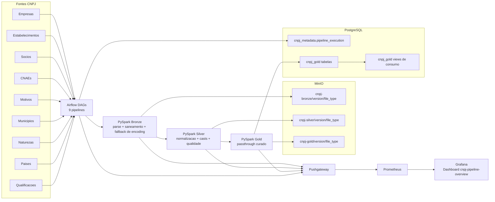

# Arquitetura — CNPJ DataLake

## Visao geral

Pipeline Medallion (Bronze / Silver / Gold) para dados publicos da Receita Federal (CNPJ),
processado com PySpark, armazenado no MinIO e orquestrado pelo Airflow.

## Desenho de arquitetura (atualizado)



---

## Estrutura de pastas

```
CNPJ-DataLake/
├── services/
│   ├── airflow/
│   │   ├── dags/cnpj_dataset_dags.py  # 9 DAGs — uma por tipo de arquivo
│   │   ├── Dockerfile
│   │   └── requirements.txt
│   ├── pyspark/cli/run_pipeline.py    # wrapper de execucao local
│   ├── minio/init-minio.sh
│   └── postgres/
│       ├── init-db.sh
│       └── schemas.sql
├── data/
│   ├── input/                     # arquivos de entrada por dataset
│   │   ├── empresas/
│   │   ├── estabelecimentos/
│   │   ├── socios/
│   │   ├── cnaes/
│   │   ├── motivos/
│   │   ├── municipios/
│   │   ├── naturezas/
│   │   ├── paises/
│   │   └── qualificacoes/
│   └── consumed/                  # arquivos movidos apos ingestao
├── docs/
├── infra/docker-compose.yml       # stack completa
├── src/
│   └── cnpj_datalake/
│       ├── config/settings.py
│       ├── domain/layouts.py      # mapeamento de colunas por tipo
│       ├── domain/models.py
│       ├── services/
│       │   ├── pyspark/           # bronze, silver, gold, orchestration, spark
│       │   ├── minio/             # client MinIO
│       │   └── postgres/          # client PostgreSQL
│       └── utils/logger.py
├── tests/
└── src/scripts/profile_source_files.py
```

---

## Fluxo de dados

```
data/input/Empresas*.txt
        |
        v
[Bronze] ingest_glob()
  - le .txt com encoding latin1
  - mapeia colunas via layouts.py
  - adiciona ingestion_ts, source_file, file_type, data_version
  - grava Parquet em cnpj-bronze/{version}/{tipo}/
        |
        v
[Silver] process()
  - trim de strings
        - remove aspas simples/duplas em campos textuais
  - cast de tipos (_SILVER_CASTS por file_type)
        - parse robusto de capital_social no padrao brasileiro
  - dropDuplicates por primary keys
  - validate_quality (% nulos no PK vs QUALITY_THRESHOLD)
  - grava Parquet em cnpj-silver/{version}/{tipo}/
        |
        v
[Gold] aggregate()
        - passthrough limpo por file_type
        - adiciona colunas dataset_month e data_version
  - grava Parquet em cnpj-gold/{version}/{dataset}/
        - DELETE WHERE dataset_month = X OR data_version = X no Postgres
        - filtra colunas compativeis com a tabela alvo
  - JDBC append em cnpj_gold.{tabela}
        |
        v
[Archive]
  - move arquivos consumidos para data/consumed/{dataset}/{data_version}/
        |
        v
[Postgres] cnpj_metadata.pipeline_execution  <- log de status
[Postgres] cnpj_gold.*                       <- data marts consultaveis
[MinIO]    cnpj-gold/*                       <- historico em Parquet
```

---

## Camadas Gold no Postgres

| Tabela | Conteudo | Tipo |
|---|---|---|
| `cnpj_gold.estabelecimentos` | dados detalhados de estabelecimentos | clean |
| `cnpj_gold.empresas` | dados detalhados de empresas | clean |
| `cnpj_gold.socios` | dados detalhados de socios | clean |
| `cnpj_gold.cnaes` | codigos e descricoes | referencia |
| `cnpj_gold.motivos` | codigos e descricoes | referencia |
| `cnpj_gold.municipios` | codigos e descricoes | referencia |
| `cnpj_gold.naturezas` | codigos e descricoes | referencia |
| `cnpj_gold.paises` | codigos e descricoes | referencia |
| `cnpj_gold.qualificacoes` | codigos e descricoes | referencia |

Todas tem colunas `dataset_month` e `data_version` — historico mensal preservado.

## Views Gold para consumo (5 views)

| View | Finalidade principal |
|---|---|
| `cnpj_gold.vw_empresas_com_uf` | empresas enriquecidas com UF a partir de estabelecimentos |
| `cnpj_gold.vw_agente_empresas_contexto` | contexto sintetico de empresas para perguntas de negocio |
| `cnpj_gold.vw_agente_estabelecimentos_contexto` | contexto de estabelecimentos com dados operacionais |
| `cnpj_gold.vw_agente_socios_contexto` | contexto de socios e qualificacoes |
| `cnpj_gold.vw_agente_cnpj_consolidado` | consolidado unico de CNPJ para consulta do agente |

Essas views sao mantidas em `services/postgres/schemas.sql` com owner e grants para `datalake_app`.

---

## Observabilidade (baseline atual)

Stack provisionada via `infra/docker-compose.yml`:
- Pushgateway (`:9091`) recebe metricas do pipeline;
- Prometheus (`:9090`) coleta do Pushgateway;
- Grafana (`:3000`) exibe o dashboard `cnpj-pipeline-overview`.

Metricas principais documentadas no baseline:
- `cnpj_pipeline_stage_runs_total`
- `cnpj_pipeline_stage_duration_seconds`
- `cnpj_pipeline_records_total`
- `cnpj_pipeline_last_stage_run_timestamp_seconds`
- `cnpj_pipeline_encoding_fallback_events_total`
- `cnpj_pipeline_encoding_fallback_corrected_rows_total`

Painel provisionado atual: ids `1..9` (inclui fallback de encoding ids `8` e `9`).
Nao fazem parte do baseline atual metricas/paineis experimentais de comportamento de IA ou uso de objetos.

---

## DAGs (9 pipelines independentes)

Definidas em `services/airflow/dags/cnpj_dataset_dags.py` via lista `DATASETS`.
Cada DAG tem 4 tasks efetivas no caminho completo: `bronze_task` -> `silver_task` -> `gold_task` -> `archive_task`.
`data_version` segue a prioridade:
1. `dag_run.conf.dataset_month` ou `dag_run.conf.data_version`
2. `INGESTION_DATA_MONTH`
3. `INGESTION_DATA_VERSION`
4. `AIRFLOW_DATA_VERSION_OVERRIDE`
5. `DATA_VERSION`
6. `logical_date.strftime("%Y-%m")`

O valor efetivo tambem e registrado em `cnpj_metadata.pipeline_execution.dataset_month` e `cnpj_metadata.pipeline_execution.data_version`.

As fontes de entrada aceitam padroes alternativos separados por `|`.
Exemplo: `Empresas*.txt|[!.]*` para suportar tanto nome padrao quanto nome cru extraido do zip.

## Inicializacao do Postgres (detalhe operacional)

Os scripts em `/docker-entrypoint-initdb.d` rodam automaticamente apenas na primeira inicializacao do volume.
Se o volume ja existir e houver divergencia de schema/tabela, reaplique manualmente `services/postgres/schemas.sql` no container Postgres.

---

## Integracao com agente de IA

O projeto `agente-contabilizei-tcc` pode consumir os data marts de duas formas:
- **PostgreSQL (principal)**: consulta `cnpj_gold.*` via `psycopg2`
- **DuckDB + httpfs (fallback)**: le Parquet diretamente do MinIO via S3

Em ambos os casos, o LLM (Groq/Llama) recebe o schema das tabelas Gold e gera SQL.

### Descoberta inteligente de tabelas no agente

Na integracao atual, o agente nao usa apenas "tabela existente" como criterio.
Ele filtra para priorizar tabelas Gold que possuem linhas no Postgres.

Implicacoes praticas:
- evita consultas em tabelas vazias (ex.: `cnpj_gold.cnaes` com 0 linhas)
- melhora a qualidade da SQL gerada para perguntas analiticas
- a lista de `dataset_month` vem da uniao das tabelas Gold populadas

### Contrato de dados para o agente

Para perguntas de negocio, a fonte recomendada e:
- `cnpj_gold.estabelecimentos`
- `cnpj_gold.empresas`
- `cnpj_gold.socios`

Tabelas de referencia (cnaes, municipios etc.) continuam disponiveis, mas podem estar vazias dependendo do ciclo de ingestao.

---

## Operacao de teste por tabela

Para limpar uma tabela especifica e reingerir o dataset sem reset total, use:

`python src/scripts/reingest_table.py --file-type empresas --source-file "data/input/empresas/Empresas*.txt" --data-version 2026-03`

O utilitario remove linhas por mes no Postgres, limpa os prefixos do dataset no MinIO e executa Bronze -> Silver -> Gold.

